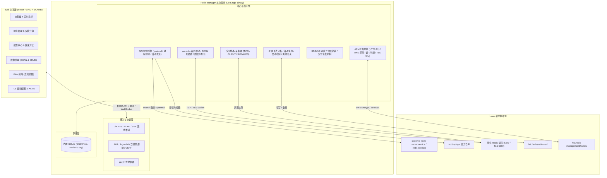
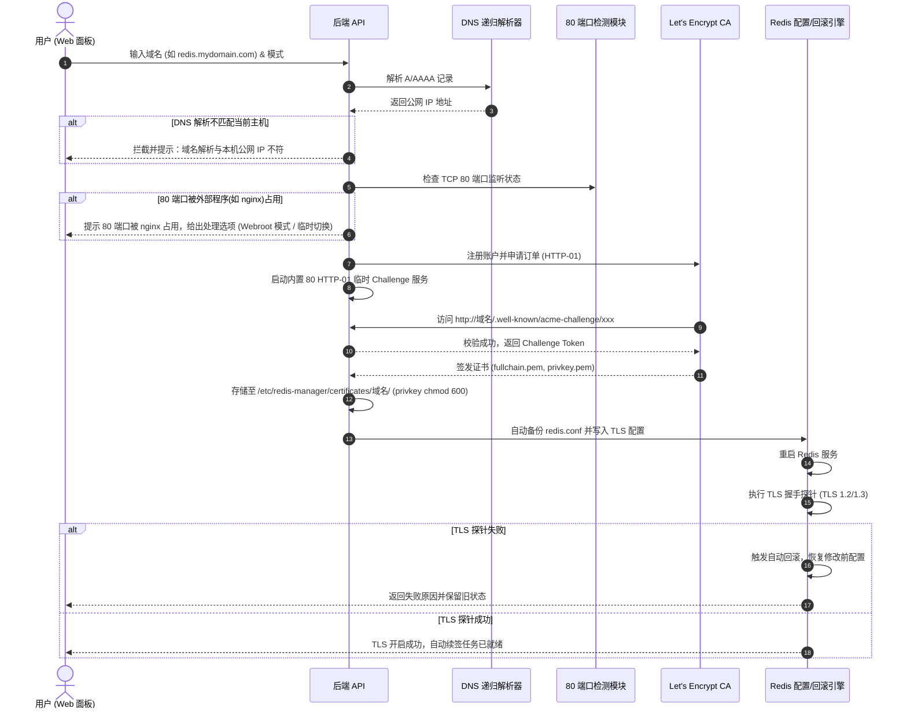

# Redis Manager 架构与设计规范

## 一、总体架构

Redis Manager 是一个专为 Linux 宿主机原生 Redis 打造的现代化、单二进制、企业级 Web 可视化运维与数据管理系统。它将**系统级服务管理**、**智能配置与灾备回滚**、**高可用 TLS 证书生命周期**与**高性能数据浏览器**高度融合。



---

## 二、技术选型

| 层次 | 技术选型 | 说明与选型理由 |
| :--- | :--- | :--- |
| **前端框架** | React 19 + TypeScript + Vite | 现代化极速构建，完备的类型安全支持 |
| **UI 组件库** | Ant Design 5.x | 企业级规范，支持无缝深浅色切换、高度可定制主题系统 |
| **视觉风格** | Vercel / Linear / HeroUI 风格 | 精致圆角卡片、低饱和微边框、清晰状态指示，告别陈旧 UI |
| **图表库** | Apache ECharts (`echarts-for-react`) | 1h/6h/24h 高性能折线图、内存分布仪表盘、网络吞吐面积图 |
| **图标库** | `@ant-design/icons` + `lucide-react` | 统一规范的现代几何感图标系统 |
| **后端语言** | Go 1.22+ | 单二进制打包、静态编译、低资源消耗、高并发原生支持 |
| **Web 框架** | Gin Web Framework | 极高性能、成熟的中间件生态、优秀的 SSE 与 REST 支持 |
| **数据库** | SQLite (`modernc.org/sqlite`) | **纯 Go 实现，无须 CGO**，完美跨平台交叉编译 (amd64 / arm64) |
| **ORM / 查询** | GORM | 自动化迁移、事务安全、查询简洁 |
| **Redis 驱动** | `github.com/redis/go-redis/v9` | 业界官方成熟客户端，支持 TLS、SCAN 流式读取、ACL |
| **ACME 引擎** | `golang.org/x/crypto/acme` | 官方 ACME 协议栈，无黑盒依赖，实现纯净 HTTP-01 自动化签发与轮换 |
| **系统交互** | 严格白名单命令系统 + 原生系统调用 | 严禁 `bash -c` 动态拼接，抵御命令注入，系统级权限隔离 |

---

## 三、数据库设计 (SQLite)

数据库存储于 `/var/lib/redis-manager/redis-manager.db`。核心表结构设计如下：

### 1. 管理员账户表 (`admins`)
- `id` (INTEGER PRIMARY KEY AUTOINCREMENT)
- `username` (VARCHAR(64) UNIQUE NOT NULL)
- `password_hash` (TEXT NOT NULL) - Bcrypt 强哈希
- `nickname` (VARCHAR(64))
- `email` (VARCHAR(128))
- `status` (INTEGER DEFAULT 1) - 1:正常 0:禁用
- `last_login_at` (DATETIME)
- `last_login_ip` (VARCHAR(64))
- `created_at`, `updated_at`

### 2. Redis 实例表 (`redis_instances`) - 支持单机多实例架构
- `id` (INTEGER PRIMARY KEY AUTOINCREMENT)
- `name` (VARCHAR(64) NOT NULL) - 默认 "Local Redis"
- `host` (VARCHAR(128) DEFAULT "127.0.0.1")
- `port` (INTEGER DEFAULT 6379)
- `tls_port` (INTEGER DEFAULT 0)
- `tls_enabled` (BOOLEAN DEFAULT 0)
- `password` (TEXT) - 加密存储或用于本地受控连接
- `socket_path` (VARCHAR(256))
- `config_path` (VARCHAR(256) DEFAULT "/etc/redis/redis.conf")
- `service_name` (VARCHAR(64) DEFAULT "redis-server")
- `is_default` (BOOLEAN DEFAULT 1)
- `created_at`, `updated_at`

### 3. TLS 证书信息表 (`certificates`)
- `id` (INTEGER PRIMARY KEY AUTOINCREMENT)
- `domain` (VARCHAR(255) UNIQUE NOT NULL)
- `provider` (VARCHAR(64) DEFAULT "letsencrypt")
- `cert_path` (VARCHAR(255) NOT NULL)
- `key_path` (VARCHAR(255) NOT NULL)
- `ca_path` (VARCHAR(255))
- `issued_at` (DATETIME NOT NULL)
- `expires_at` (DATETIME NOT NULL)
- `auto_renew` (BOOLEAN DEFAULT 1)
- `status` (VARCHAR(32)) - "valid", "renewing", "expired", "failed"
- `last_renew_at` (DATETIME)
- `last_renew_error` (TEXT)
- `created_at`, `updated_at`

### 4. 配置备份表 (`config_backups`)
- `id` (INTEGER PRIMARY KEY AUTOINCREMENT)
- `instance_id` (INTEGER NOT NULL)
- `backup_path` (VARCHAR(255) NOT NULL)
- `remark` (VARCHAR(255)) - "修改前自动备份", "开启TLS前备份"等
- `content_sha256` (VARCHAR(64) NOT NULL)
- `created_at`

### 5. 数据快照与备份表 (`backups`)
- `id` (INTEGER PRIMARY KEY AUTOINCREMENT)
- `instance_id` (INTEGER NOT NULL)
- `file_name` (VARCHAR(255) NOT NULL)
- `file_path` (VARCHAR(255) NOT NULL)
- `file_size` (BIGINT NOT NULL)
- `redis_version` (VARCHAR(32))
- `backup_type` (VARCHAR(32) DEFAULT "rdb")
- `created_at`

### 6. 操作审计日志表 (`audit_logs`)
- `id` (INTEGER PRIMARY KEY AUTOINCREMENT)
- `user_id` (INTEGER NOT NULL)
- `username` (VARCHAR(64) NOT NULL)
- `action` (VARCHAR(64) NOT NULL) - 如 "START_REDIS", "UPDATE_CONFIG", "ENABLE_TLS", "RESTORE_BACKUP"
- `resource` (VARCHAR(128))
- `details` (TEXT) - 结构化 JSON 描述变更前后差异
- `ip` (VARCHAR(64) NOT NULL)
- `user_agent` (TEXT)
- `status` (VARCHAR(16) NOT NULL) - "SUCCESS", "FAILED"
- `created_at`

### 7. 系统配置与键值表 (`settings`)
- `key` (VARCHAR(64) PRIMARY KEY)
- `value` (TEXT NOT NULL)
- `updated_at`

---

## 四、API 设计规范

所有 API 遵循统一规范响应体：
```json
{
  "code": 0,
  "message": "success",
  "data": {}
}
```
非 0 code 表示业务异常，并在 message 中包含清晰的中文原因与解决建议。

### 1. 认证与账户 (`/api/v1/auth`)
- `POST /api/v1/auth/login` - 登录 (带防暴力破解限速与 IP 记录)
- `POST /api/v1/auth/logout` - 退出登录
- `GET  /api/v1/auth/current` - 获取当前登录身份信息
- `PUT  /api/v1/auth/password` - 修改管理员密码

### 2. 系统信息与发现 (`/api/v1/system`)
- `GET  /api/v1/system/info` - 宿主机 CPU、内存、磁盘、系统版本、运行时间
- `GET  /api/v1/system/ports` - 检测 80、6379 等端口占用情况与关联进程名
- `GET  /api/v1/system/dns-check?domain=xxx` - 解析域名的 A/AAAA 记录并与本机公网 IP 比对

### 3. Redis 服务管理 (`/api/v1/redis`)
- `GET  /api/v1/redis/discovery` - 自动探测本机是否已安装 Redis（路径、服务、版本、PID）
- `POST /api/v1/redis/install` - 自动化安装原生 Redis (可选 Redis 7 / 8 / 官方源)
- `POST /api/v1/redis/start` - 启动 Redis 服务
- `POST /api/v1/redis/stop` - 停止 Redis 服务
- `POST /api/v1/redis/restart` - 重启 Redis 服务
- `POST /api/v1/redis/reload` - 重新加载配置
- `POST /api/v1/redis/autostart` - 开启/关闭 systemd 开机自启
- `POST /api/v1/redis/uninstall` - 卸载 Redis (需二次确认输入危险验证码)
- `GET  /api/v1/redis/status` - 获取服务运行状态 (active, inactive, pid, uptime)

### 4. 实时监控与指标 (`/api/v1/redis/monitor`)
- `GET  /api/v1/redis/info` - 完整 Redis INFO 分组解析
- `GET  /api/v1/redis/metrics/stream` - SSE 实时事件流，每 1.5 秒推送核心监控指标
- `GET  /api/v1/redis/metrics/history?range=1h|6h|24h` - 监控历史折线图采样数据

### 5. Redis 配置管理 (`/api/v1/redis/config`)
- `GET  /api/v1/redis/config` - 获取当前生效的配置键值字典
- `PUT  /api/v1/redis/config` - 结构化表单修改常用参数 (bind, maxmemory, timeout 等)
- `GET  /api/v1/redis/config/raw` - 获取完整 `redis.conf` 文本
- `PUT  /api/v1/redis/config/raw` - 覆写 `redis.conf`（自动前置备份 + 语法校验 + 重启验证 + 失败自动回滚）
- `GET  /api/v1/redis/config/backups` - 获取配置备份历史
- `POST /api/v1/redis/config/rollback` - 手动回滚指定历史版本

### 6. Redis 数据管理 (`/api/v1/redis/data`)
- `GET  /api/v1/redis/data/db-info` - 获取 0-15 号库的 Key 数量与内存使用
- `GET  /api/v1/redis/data/keys` - 基于 `SCAN` 游标安全搜索 Key（带分页、通配符、类型筛选）
- `GET  /api/v1/redis/data/key` - 获取单个 Key 的类型、TTL、编码、内存占用及 Value
- `POST /api/v1/redis/data/key` - 创建新 Key（支持 String, Hash, List, Set, ZSet, Stream）
- `PUT  /api/v1/redis/data/key` - 更新 Key 的值
- `DELETE /api/v1/redis/data/key` - 删除单个 Key (UNLINK/DEL)
- `POST /api/v1/redis/data/keys/batch-delete` - 批量删除 Key
- `PUT  /api/v1/redis/data/key/ttl` - 设置/移除 Key 的 TTL
- `PUT  /api/v1/redis/data/key/rename` - 重命名 Key

### 7. Web CLI 与安全终端 (`/api/v1/redis/cli`)
- `POST /api/v1/redis/cli/exec` - 安全执行 Redis 命令（拦截高危命令需附带 `force: true`）

### 8. 客户端与慢查询 (`/api/v1/redis/clients`, `/api/v1/redis/slowlog`)
- `GET  /api/v1/redis/clients` - 解析 CLIENT LIST 获取在线连接
- `POST /api/v1/redis/clients/kill` - 断开指定客户端连接
- `GET  /api/v1/redis/slowlog` - 获取 SLOWLOG 列表与执行耗时
- `POST /api/v1/redis/slowlog/reset` - 清空慢日志

### 9. 自动化 TLS 与证书管理 (`/api/v1/redis/tls`)
- `GET  /api/v1/redis/tls/status` - 获取当前 TLS 配置、证书有效时间、到期倒计时
- `POST /api/v1/redis/tls/enable` - 一键申请证书并无缝应用到 Redis 配置
- `POST /api/v1/redis/tls/disable` - 关闭 TLS，安全恢复为普通 TCP 端口
- `POST /api/v1/redis/tls/renew` - 手动立即触发 ACME 续期与重载测试
- `GET  /api/v1/redis/tls/test` - 执行 TLS 握手探针与连通性验证

### 10. 数据备份与恢复 (`/api/v1/redis/backups`)
- `GET  /api/v1/redis/backups` - 获取历史 RDB 快照列表
- `POST /api/v1/redis/backups/create` - 触发 BGSAVE 并归档备份文件
- `POST /api/v1/redis/backups/restore` - 恢复指定快照（执行前强制自动创建最新保护快照）
- `GET  /api/v1/redis/backups/download/:id` - 下载 RDB 备份文件
- `DELETE /api/v1/redis/backups/:id` - 删除指定快照

### 11. 日志与审计 (`/api/v1/logs`, `/api/v1/audit`)
- `GET  /api/v1/logs/redis` - 获取 Redis 运行日志或 journalctl 日志流
- `GET  /api/v1/audit/logs` - 查询系统管理员操作审计流水

---

## 五、Redis 管理核心实现方案

### 1. 已有 Redis 智能检测与自动接管
系统启动或进入面板时，自动遍历检测：
- 可执行文件路径：`/usr/bin/redis-server`, `/usr/local/bin/redis-server`, `/www/server/redis/bin/redis-server` 等
- 配置文件候选：`/etc/redis/redis.conf`, `/etc/redis.conf`, `/usr/local/etc/redis/redis.conf`, `/www/server/redis/redis.conf`
- 服务识别：检测 systemd 服务 `redis-server.service`、`redis.service` 状态
- 进程探测：查询监听 6379 的进程 PID、启动参数，获取其实际生效的 `dir`, `port`, `logfile`, `requirepass`

### 2. 原生安装与服务化 (Debian/Ubuntu)
- 通过原生包管理器安全安装官方推荐版本；
- 自动写入受控的标准 systemd 配置文件（如果缺失）；
- 初始化标准化数据目录 `/var/lib/redis` 与日志目录 `/var/log/redis`，配置属主 `redis:redis`。

### 3. 配置修改与“零宕机”自动回滚机制
修改 `redis.conf` 时执行强原子性工作流：
1. **备份阶段**：将当前正在运行的配置文件复制为 `/etc/redis-manager/backups/redis.conf.<timestamp>.bak`，并写入数据库版本表；
2. **写入阶段**：使用安全临时文件写入新配置，原子性替换目标文件；
3. **语法与校验阶段**：调用 `redis-server /path/to/test.conf --test-memory` 或启动独立守护进程进行静态语法测试；
4. **平滑重载/重启**：使用 systemd 执行 `restart` 或 `reload`；
5. **健康探针探测**：在 5 秒内以 500ms 间隔尝试连接 Ping Redis 端口；
6. **自动恢复机制**：若探针超时或进程退出，立即将备份的 `.bak` 还原，再次触发重启并返回具体错误堆栈给前端，确保不破坏用户现有服务。

---

## 六、ACME / TLS 一键自动化实现方案



### 证书自动续签后台守护任务
- 后端后台常驻 Ticker（每天 02:00 与 14:00 各执行一次巡检）；
- 扫描数据库中 `auto_renew = true` 的证书；
- 当证书剩余有效天数 $\le 30$ 天时，自动发起 ACME 续期请求；
- 续期成功后，无缝替换证书文件，执行 `redis-server` 平滑重载并触发探针校验；
- 任何续签异常直接记录至审计日志并在面板显眼位置预警，绝不静默失败。

---

## 七、安全模型与防注入规范

1. **绝对禁止动态 Shell 拼接**：系统调用全部采用 Go 标准库 `exec.Command(name, arg1, arg2...)` 传参，坚决杜绝 `exec.Command("bash", "-c", userInput)` 这种命令注入隐患。
2. **输入白名单与域名校验**：所有域名严格经过正则表达式校验（`^[a-zA-Z0-9]([a-zA-Z0-9-]{0,61}[a-zA-Z0-9])?(\.[a-zA-Z0-9]([a-zA-Z0-9-]{0,61}[a-zA-Z0-9])?)+$`），彻底消除路径遍历与注入攻击。
3. **密码与安全哈希**：管理员密码采用行业标准 Bcrypt，配合登录失败指数级退避限速策略。
4. **脱敏保护**：所有日志处理与审计记录自动脱敏 `requirepass`、`masterauth` 及私钥内容。
5. **危险命令防护机制**：在 Web CLI 中，对 `FLUSHALL`, `FLUSHDB`, `CONFIG SET`, `DEBUG`, `SHUTDOWN` 等毁灭性操作进行强制拦截，必须前端弹窗二次明确输入确认字符才可放行。

---

## 八、完整项目目录设计

```text
Redis可视化面板/
├── cmd/
│   └── redis-manager/            # 主程序入口 (CLI + Web Server)
│       └── main.go
├── internal/
│   ├── acme/                     # ACME 客户端、DNS 校验、HTTP-01 服务、自动续签调度器
│   │   ├── client.go
│   │   ├── dns.go
│   │   ├── renew.go
│   │   └── cert_manager.go
│   ├── api/                      # Gin 路由、控制器、统一响应封装、SSE
│   │   ├── router.go
│   │   ├── response.go
│   │   ├── auth_handler.go
│   │   ├── system_handler.go
│   │   ├── redis_handler.go
│   │   ├── config_handler.go
│   │   ├── data_handler.go
│   │   ├── cli_handler.go
│   │   ├── monitor_handler.go
│   │   ├── client_handler.go
│   │   ├── tls_handler.go
│   │   ├── backup_handler.go
│   │   └── audit_handler.go
│   ├── auth/                     # JWT 生成与校验、密码哈希、防爆破限速器
│   │   ├── jwt.go
│   │   ├── password.go
│   │   └── ratelimit.go
│   ├── database/                 # SQLite 初始化、GORM 模型定义、数据迁移
│   │   ├── db.go
│   │   └── models.go
│   ├── redis/                    # 原生 Redis 发现、服务启停、配置解析、备份与回滚引擎
│   │   ├── discovery.go
│   │   ├── service.go
│   │   ├── config_parser.go
│   │   ├── rollback.go
│   │   ├── client_pool.go
│   │   ├── data_browser.go
│   │   └── backup.go
│   ├── system/                   # Linux 宿主机硬件资源、端口监听、进程检测
│   │   ├── host_info.go
│   │   ├── port_checker.go
│   │   └── process.go
│   └── config/                   # 面板配置文件读写与全局变量
│       └── config.go
├── frontend/                     # React 19 + TypeScript + Vite + AntD 5 前端源码
│   ├── public/
│   │   └── favicon.svg
│   ├── src/
│   │   ├── api/                  # Axios 封装与各模块接口定义
│   │   │   ├── request.ts
│   │   │   ├── auth.ts
│   │   │   ├── system.ts
│   │   │   ├── redis.ts
│   │   │   ├── data.ts
│   │   │   ├── tls.ts
│   │   │   └── backup.ts
│   │   ├── components/           # 通用组件：卡片、终端、统计指标、状态徽章
│   │   │   ├── MetricCard.tsx
│   │   │   ├── StatusBadge.tsx
│   │   │   ├── DangerModal.tsx
│   │   │   └── Terminal.tsx
│   │   ├── layouts/              # 现代化响应式布局 (侧边栏 + 顶栏 + 主题切换)
│   │   │   ├── MainLayout.tsx
│   │   │   └── MainLayout.css
│   │   ├── pages/                # 各功能页面
│   │   │   ├── Login/
│   │   │   ├── Dashboard/        # 实时概览与 ECharts 历史趋势
│   │   │   ├── Service/          # 原生安装、接管、启停与升级
│   │   │   ├── Config/           # 可视化设置、原始 redis.conf 编辑与回滚对比
│   │   │   ├── Data/             # SCAN 浏览器、String/Hash/List/Set/ZSet/Stream
│   │   │   ├── Cli/              # Web Redis 命令行终端
│   │   │   ├── Clients/          # 在线连接池与断开
│   │   │   ├── SlowLog/          # 慢日志监控
│   │   │   ├── TLS/              # 一键 ACME 申请、DNS 校验、探针与开关
│   │   │   ├── Backup/           # RDB 备份、下载与安全恢复
│   │   │   ├── Logs/             # Redis 实时日志与 journalctl
│   │   │   └── Audit/            # 操作审计日志
│   │   ├── types/                # 全局 TypeScript 接口定义
│   │   ├── utils/                # 格式化、转换函数
│   │   ├── App.tsx
│   │   ├── App.css
│   │   └── main.tsx
│   ├── index.html
│   ├── package.json
│   ├── tsconfig.json
│   └── vite.config.ts
├── scripts/                      # 一键部署与管理脚本
│   ├── install.sh                # 官方一键 curl 安装脚本
│   └── uninstall.sh              # 干净卸载脚本
├── deploy/
│   └── redis-manager.service     # systemd 服务定义文件
├── .github/
│   └── workflows/
│       └── release.yml           # GitHub Actions 跨平台静态构建 (amd64 / arm64)
├── Makefile                      # 统一构建与测试入口
├── go.mod
├── go.sum
└── README.md
```
